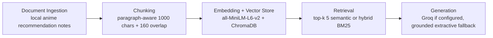

# Project 1 Planning: The Unofficial Guide

## Domain

My domain is highly acclaimed must-watch anime. I chose this because anime recommendations are easy to find in huge lists, but it is harder to get a grounded answer that explains *why* a title fits a specific viewer mood. Official pages usually give scores, summaries, or availability, while fan conversations often assume the reader already knows the major classics. This guide tries to combine critic/list evidence with practical recommendation notes for someone deciding what to watch next.

## Documents

| # | Source | Description | URL or location |
|---|--------|-------------|-----------------|
| 1 | Spirited Away gateway film notes | Gateway movie recommendation using Rotten Tomatoes and BFI source context | `documents/raw/01_spirited_away_gateway.txt` |
| 2 | Cowboy Bebop series notes | Classic stylish series recommendation using Rotten Tomatoes and IMDb source context | `documents/raw/02_cowboy_bebop_series.txt` |
| 3 | Fullmetal Alchemist: Brotherhood notes | Complete adventure epic recommendation using MAL and IMDb source context | `documents/raw/03_fullmetal_alchemist_brotherhood.txt` |
| 4 | Frieren modern fantasy notes | Recent fantasy recommendation using MAL and Decider source context | `documents/raw/04_frieren_modern_fantasy.txt` |
| 5 | Steins;Gate sci-fi notes | Time-travel recommendation using MAL and IMDb source context | `documents/raw/05_steins_gate_sci_fi.txt` |
| 6 | Neon Genesis Evangelion notes | Psychological mecha recommendation using BFI and Netflix source context | `documents/raw/06_evangelion_psychological_mecha.txt` |
| 7 | Akira cyberpunk film notes | Landmark cyberpunk movie recommendation using Rotten Tomatoes and BFI source context | `documents/raw/07_akira_cyberpunk_film.txt` |
| 8 | Grave of the Fireflies notes | Emotional war drama recommendation using Rotten Tomatoes and BFI source context | `documents/raw/08_grave_of_the_fireflies.txt` |
| 9 | Attack on Titan dark action notes | Serialized action recommendation using Crunchyroll and IMDb source context | `documents/raw/09_attack_on_titan_dark_action.txt` |
| 10 | Your Name romance gateway notes | Modern romance movie recommendation using Rotten Tomatoes and IMDb source context | `documents/raw/10_your_name_romance_gateway.txt` |
| 11 | Mob Psycho 100 character-growth notes | Supernatural comedy/action recommendation using MAL and IMDb source context | `documents/raw/11_mob_psycho_character_growth.txt` |
| 12 | Watch matching synthesis guide | Cross-title matching guide based on the other source notes | `documents/raw/12_watch_order_and_matching.txt` |

## Chunking Strategy

**Chunk size:** 1000 characters.

**Overlap:** 160 characters.

**Reasoning:** Each source document is a recommendation card with three short paragraphs: why the anime is acclaimed, what the outside sources support, and when I would or would not recommend it. A 1000-character chunk usually keeps one full card together, so the retriever can return the title, source evidence, and recommendation caveat in one result. The 160-character overlap protects the boundary between source evidence and recommendation notes without creating too many duplicate hits.

## Retrieval Approach

**Embedding model:** `sentence-transformers/all-MiniLM-L6-v2`.

**Top-k:** 5 chunks for normal retrieval.

**Production tradeoff reflection:** I chose `all-MiniLM-L6-v2` because it is local, free, quick to run, and strong enough for a small English recommendation corpus. For a real anime recommendation system, I would compare retrieval quality on fuzzy taste queries, multilingual handling for Japanese titles and romanized names, latency, privacy, and cost. I would also consider a larger embedding model if it handled subjective wording like "bittersweet," "cozy," or "psychological" better.

The implementation includes hybrid search as a stretch feature. Hybrid search combines semantic similarity and BM25 keyword scoring with a weighted score of 65% semantic and 35% BM25. This helps exact-title queries such as "Steins;Gate" or "Mob Psycho 100" while still supporting mood-based queries like "sad war movie" or "gateway anime."

## Evaluation Plan

| # | Question | Expected answer |
|---|----------|-----------------|
| 1 | What is a good gateway anime movie for someone new to anime? | Spirited Away is a strong gateway film; Your Name is also a modern accessible option. |
| 2 | Which anime should I watch for cyberpunk and landmark animation? | Akira. |
| 3 | What should I watch if I want a complete adventure series with a strong ending? | Fullmetal Alchemist: Brotherhood. |
| 4 | Which recommendation fits a recent thoughtful fantasy about memory and grief? | Frieren: Beyond Journey's End. |
| 5 | What anime should I avoid recommending as a casual comfort watch because it is emotionally devastating? | Grave of the Fireflies. |

## Anticipated Challenges

1. Mood-based queries can overlap across titles. For example, "emotional anime" could retrieve Your Name, Frieren, or Grave of the Fireflies, but those have very different viewing moods.

2. Exact-title punctuation can affect retrieval. A query for "Steins Gate" without the semicolon should still find `Steins;Gate`, so hybrid search and tokenization need to help with title variants.

3. The fallback answerer is extractive, so it can cite real chunks but may sound less natural than a full LLM response. I will judge the system on grounded correctness rather than polish.

## Architecture

## AI Tool Plan

**Milestone 3 - Ingestion and chunking:** I will use Codex to help adapt the existing loader and chunker to the anime corpus, then verify the chunk samples myself. The main thing I will check is whether each anime card stays readable as a standalone chunk.

**Milestone 4 - Embedding and retrieval:** I will use Codex to update the evaluation questions and run semantic/hybrid retrieval tests. I will verify that exact-title questions and mood-based questions both return relevant source documents.

**Milestone 5 - Generation and interface:** I will use Codex to update the CLI examples, refusal behavior, README report, and stretch-feature comparisons. I will review the actual command outputs and keep at least one honest partial failure if the system struggles.
