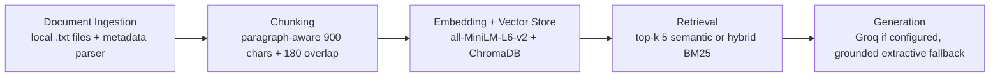

# Project 1 Planning: The Unofficial Guide

## Domain

My domain is an unofficial student survival guide for completing CodePath AI201 Project 1. This knowledge is valuable because the assignment instructions and grading rubric are detailed, but students can still miss practical scoring details like sample chunks, refusal examples, retrieval explanations, and AI usage transparency. It is hard to find through one official channel because the requirements are spread across assignment milestones, hints, and rubric rows, and students benefit from a searchable guide that turns those scattered requirements into direct answers.

## Documents

| # | Source | Description | URL or location |
|---|--------|-------------|-----------------|
| 1 | Student Notes - Choosing the Project 1 Domain | Domain and scope advice for the AI201 Project 1 survival guide | `documents/raw/01_domain_and_scope.txt` |
| 2 | Student Notes - Document Collection Checklist | Checklist for collecting at least 10 documents and recording sources | `documents/raw/02_document_collection.txt` |
| 3 | Student Notes - planning.md Must Be Written First | Requirements for planning.md, evaluation questions, and architecture | `documents/raw/03_planning_md_requirements.txt` |
| 4 | Student Notes - Chunking Strategy for Short Advice Documents | Recommended chunk size, overlap, and chunk inspection advice | `documents/raw/04_chunking_strategy.txt` |
| 5 | Student Notes - Ingestion and Cleaning | Notes on parsing metadata, cleaning documents, and validating output | `documents/raw/05_ingestion_cleaning.txt` |
| 6 | Student Notes - Retrieval, Embeddings, and Hybrid Search | Embedding model, top-k, semantic retrieval, and BM25 hybrid notes | `documents/raw/06_retrieval_semantic_hybrid.txt` |
| 7 | Student Notes - Grounded Generation and Source Attribution | Grounding prompt, refusal behavior, citations, and relevance threshold | `documents/raw/07_grounded_generation.txt` |
| 8 | Student Notes - Query Interface Expectations | CLI fields, sample transcript expectations, filters, and memory mode | `documents/raw/08_query_interface.txt` |
| 9 | Student Notes - Evaluation Report and Failure Case | Evaluation table, retrieval examples, and root-cause failure analysis | `documents/raw/09_evaluation_report.txt` |
| 10 | Student Notes - Stretch Feature Strategy | Hybrid search, chunk comparison, metadata filtering, and memory stretch notes | `documents/raw/10_stretch_features.txt` |
| 11 | Student Notes - AI Usage Transparency | Specific AI collaboration examples and revision expectations | `documents/raw/11_ai_usage_transparency.txt` |
| 12 | Student Notes - Common Rubric Point Traps | Easy-to-miss README requirements from the grading rubric | `documents/raw/12_rubric_point_traps.txt` |

## Chunking Strategy

**Chunk size:** 900 characters, using paragraph-aware packing before falling back to sentence/character splitting.

**Overlap:** 180 characters.

**Reasoning:** The corpus is made of short, student-style advice documents where each useful idea usually fits in one to three paragraphs. A 900-character target keeps a complete thought together, such as a rubric requirement plus its reason, without mixing too many unrelated topics. The 180-character overlap protects paragraph transitions, which matters when a requirement appears at the end of one paragraph and its explanation appears in the next. If chunks were much smaller, retrieval might return fragments that cannot answer a question alone; if chunks were much larger, queries about a specific rubric item could match a broad chunk with too much noise.

## Retrieval Approach

**Embedding model:** `sentence-transformers/all-MiniLM-L6-v2`.

**Top-k:** 5 chunks for normal retrieval. The CLI can show fewer retrieved chunks for readability, but the generator receives up to 5.

**Production tradeoff reflection:** I chose `all-MiniLM-L6-v2` because it is free, local, fast, and strong enough for a small English-language student guide. In production, I would weigh accuracy on messy student language, support for longer chunks, multilingual support, latency, privacy, API reliability, and cost. A larger hosted embedding model might retrieve better answers for ambiguous questions, but it would add API latency, recurring cost, and dependency on an external service. A local model is cheaper and private, but usually less accurate than top hosted models.

The implementation will also include hybrid search as a stretch feature. Hybrid search combines semantic similarity with BM25 keyword scoring using a weighted score of 65% semantic and 35% BM25. This should help exact rubric words such as `planning.md`, `top-k`, and `sample chunks` while keeping semantic matching for paraphrased questions.

## Evaluation Plan

| # | Question | Expected answer |
|---|----------|-----------------|
| 1 | How many source documents does the project need, and how should they be identified? | At least 10 documents, pages, threads, or files; the README should identify them with specific URLs, subreddit names, file paths, or file descriptions. |
| 2 | What chunk size and overlap does this project use, and why? | 900 characters with 180 characters of overlap; this fits short advice documents by preserving one to three paragraph thoughts while protecting transitions. |
| 3 | Which embedding model is used, and what top-k value does retrieval use? | `sentence-transformers/all-MiniLM-L6-v2`; top-k is 5. |
| 4 | What must the system do when a query is not supported by the retrieved documents? | It must refuse to answer and say the corpus does not contain enough information instead of guessing. |
| 5 | What does the README evaluation report need to include for each of the five test questions? | The question, expected answer, actual system response, retrieved chunks, and an accuracy judgment. |

## Anticipated Challenges

1. The embedding model may retrieve a general rubric overview when the question asks for a very specific point value or checklist item. That would be a retrieval-ranking problem, especially when semantic similarity prefers a broad document over a precise one.

2. Chunk boundaries could split a requirement from the explanation that makes it useful. The paragraph-aware chunker and 180-character overlap are intended to reduce this risk, but the failure analysis should still check whether missing context caused any wrong answers.

3. The optional Groq generation step may be unavailable if no API key is set. The implementation should include a deterministic grounded fallback answerer so the project remains demoable without paid tools or secrets.

## Architecture

## AI Tool Plan

**Milestone 3 - Ingestion and chunking:** I will direct Codex with the Documents and Chunking Strategy sections and ask it to implement a loader, cleaner, and paragraph-aware `chunk_text()` function. I expect it to produce Python code that parses metadata, strips noisy formatting, and emits chunks with source metadata. I will verify by printing at least five labeled chunks and checking that they are readable on their own.

**Milestone 4 - Embedding and retrieval:** I will direct Codex with the Retrieval Approach section and ask it to implement ChromaDB indexing, semantic search, and the hybrid BM25 comparison. I expect code that names `sentence-transformers/all-MiniLM-L6-v2`, stores chunk metadata, retrieves top-k results, and supports category filtering. I will verify using the five evaluation questions and three documented retrieval test queries.

**Milestone 5 - Generation and interface:** I will direct Codex with the Grounded Generation, Evaluation Plan, and Query Interface requirements from the assignment. I expect a CLI that accepts a question, prints a cited grounded answer, can show retrieved chunks, refuses out-of-scope questions, and supports an interactive memory mode. I will verify by running the evaluation script and recording the actual outputs in the README.
